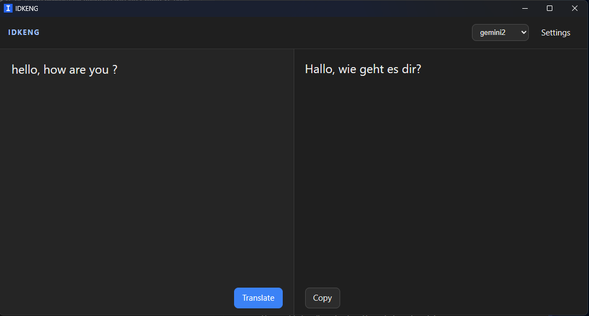

# IDKENG

Windows translator. Select text, press the shortcut, read the translation.

The app does not ship an API key. You add your own.

## Demo



https://github.com/user-attachments/assets/f02e29b2-d19a-4751-b3c7-627abce6ee65

## Download a release

Windows 10 or 11. [WebView2](https://developer.microsoft.com/microsoft-edge/webview2/) is already installed on current Windows 11.

1. Open [Releases](https://github.com/onurkopuz464/IDKENG/releases) and download `IDKENG.exe`.
2. Run it. You can keep the file anywhere.
3. Add an API in Settings, then translate.

The release build can start with Windows. The `npm run tauri dev` build cannot. That build only works while the Vite dev server is running.

## Use it

1. Open IDKENG.
2. Settings, then **APIs**. Add a name, a provider, a model, and a key. Providers: Gemini, OpenAI, Groq, OpenRouter, or any `https://` endpoint that speaks the OpenAI chat format. Pick the active one with the radio button.
3. Settings, then **Translation**. Choose your native language. The first prompt rule is the target language. Change the language in that rule and the sentence updates. Example: native English and German in the rule means English goes to German, and every other language comes back to English. Press **Save**.
4. Select text in any app and press the shortcut. The default is Ctrl+C, then C again. The first Ctrl+C still copies. The second C translates the selection.
5. The translation shows on the right. **Copy** puts it on the clipboard. You can also type on the left and press **Translate**.

Closing the window hides IDKENG in the tray. Double-click the tray icon to open it. Quit is in the tray menu.

## Settings

**Interface.** App language and the shortcut. Hold the modifiers, press the key once, or press it twice for a double tap. Esc cancels.

**Translation.** Native language, prompt rules, and a log of what was sent and received. The first rule is fixed and follows the languages you pick. Add, edit, or remove the rules under it. **Restore defaults** rebuilds the list. Empty rules are dropped on save.

**APIs.** As many named keys as you want. The menu in the top bar switches the active one.

**Advanced.** Timeout, max output tokens, and whether a busy Gemini model should try the next model. Also: start with Windows, close to the tray, and start hidden in the tray.

Keys and settings stay on this PC, encrypted with Windows DPAPI, under `%AppData%\com.idkeng.app`. They are not in this repository.

App languages: Turkish, English, German, French, Spanish, Italian, Portuguese, Russian, Arabic, Japanese, Chinese, and Korean.

## Build it yourself

You need Node.js, Rust, and the Visual Studio 2022 C++ build tools.

```powershell
cd E:\IDKENG
npm install
$env:Path = "$env:USERPROFILE\.cargo\bin;" + $env:Path
npm run tauri build
```

The executable is `src-tauri\target\release\idkeng.exe`.

`npm run tauri dev` is only for development. It loads the UI from `http://localhost:1420`.

## License

[MIT](LICENSE). You can use it, change it, and send a pull request.

## Owner note

I built this project entirely with AI. There may be tons of bugs and hundreds of lines of nonsense code, but it does the job for me. You can get a Gemini API key from [Google AI Studio](https://aistudio.google.com/) and use it for free. I still have not hit the daily quota.
